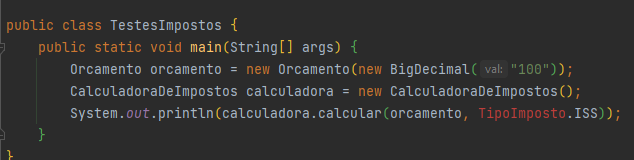
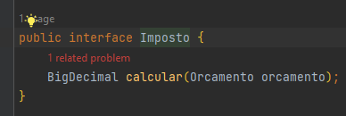
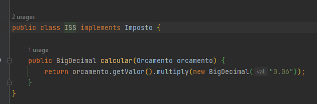
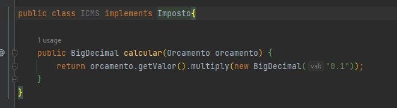
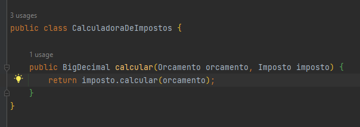
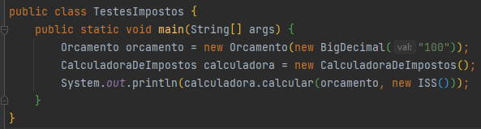

<h1 align="center">:file_cabinet: Projeto Design Patterns Com Java</h1>

## Strategy
É um padrão de projeto comportamental. Permite definir novos conjuntos de algorítimos sem alterar as classes dos elementos sobre os quais opera. No padrão Strategy, criamos objetos que representam várias estratégias e um objeto de contexto cujo comportamento varia de acordo com o seu objeto de estratégia. Por exemplo:

- Problema inicial. Temos uma classe, CalculadoraDeImpostos, com um switch. Dentro de cada teste do switch temos a regra de negócio a ser aplicado. Sendo assim, cada vez que tivermos um novo imposto será necessário adicionar um novo teste:

- Aqui temos um classe de teste para exemplificar:

- Agora refatorando. Criamos uma Interface Imposto. Dentro dessa interface criamos um método calcular().

- Criamos um classe ISS e ICMS, que implementam a interface Imposto. Agora, nestas classes colocamos as regras de negócio. Pois, sabemos qual é o cálculo a ser feito, para cada uma.

- Aqui temos a refatoração da classe CalculadoraDeImpostos. Acabamos com todos aqueles testes e passamos por parâmetro somente a interface Imposto.

- Agora, nos nossos testes, precisamos passar por parâmetro somente a classe correspondente ao desconto que queremos.

