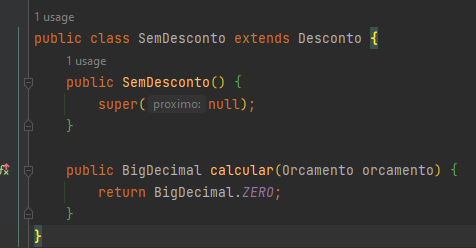

<h1 align="center">:file_cabinet: Projeto Design Patterns Com Java</h1>

## Strategy
É um padrão de projeto comportamental. Permite definir novos conjuntos de algorítimos sem alterar as classes dos elementos sobre os quais opera. No padrão Strategy, criamos objetos que representam várias estratégias e um objeto de contexto cujo comportamento varia de acordo com o seu objeto de estratégia. Por exemplo:

- Problema inicial. Temos uma classe, CalculadoraDeImpostos, com um switch. Dentro de cada teste do switch temos a regra de negócio a ser aplicado. Sendo assim, cada vez que tivermos um novo imposto será necessário adicionar um novo teste:

- Aqui temos um classe de teste para exemplificar:

- Agora refatorando. Criamos uma Interface Imposto. Dentro dessa interface criamos um método calcular().

- Criamos um classe ISS e ICMS, que implementam a interface Imposto. Agora, nestas classes colocamos as regras de negócio. Pois, sabemos qual é o cálculo a ser feito, para cada uma.

- Aqui temos a refatoração da classe CalculadoraDeImpostos. Acabamos com todos aqueles testes e passamos por parâmetro somente a interface Imposto.

- Agora, nos nossos testes, precisamos passar por parâmetro somente a classe correspondente ao desconto que queremos.

## Chain of Responsability
É um padrão de projeto  comportamental. É usado para obter um acoplamento flexível no design de software, onde uma solicitação é passada por uma cadeia de objetos para processa-la. Encadear os recpetores, passando a solicitação ao longo da cadeia até que um objeto a trate.

- Problema Inicial. Temos a Classe CalculadoraDeDescontos. Nessa classe não sabemos exatamente qual o valor do desconto, diferentemente da CalculadoraDeImpostos que sabíamos o que cada imposto deveria descontar. Neste caso temos um série de condições que podem dar desconto.

- Criamos uma classe Abstrata Desconto.

- Criamos uma Classe para Calcular o Desconto para orçamentos com mais de 5 itens.

- Criamos uma Classe para Calcular o Desconto para orçamentos com valor maior que 500 reais.

- Criamos uma Classe SemDesconto, para caso não entre em nenhuma das anteriores seja encerrado o processo.

- A nova montagem da regra de calcular desconto. Nesse caso passamos o orçamento como parâmetro, e o método vai seguindo uma cadeia para validar os desconto e por final cai no sem desconto.

- Chamanda do teste:

